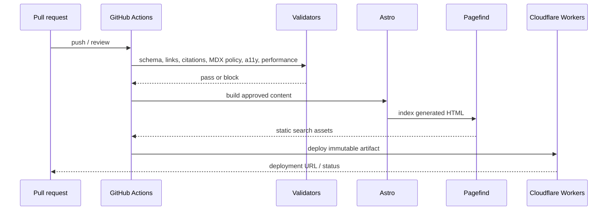
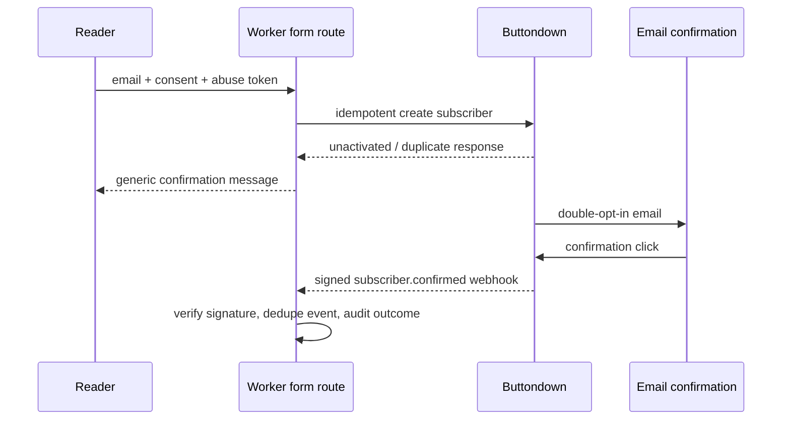
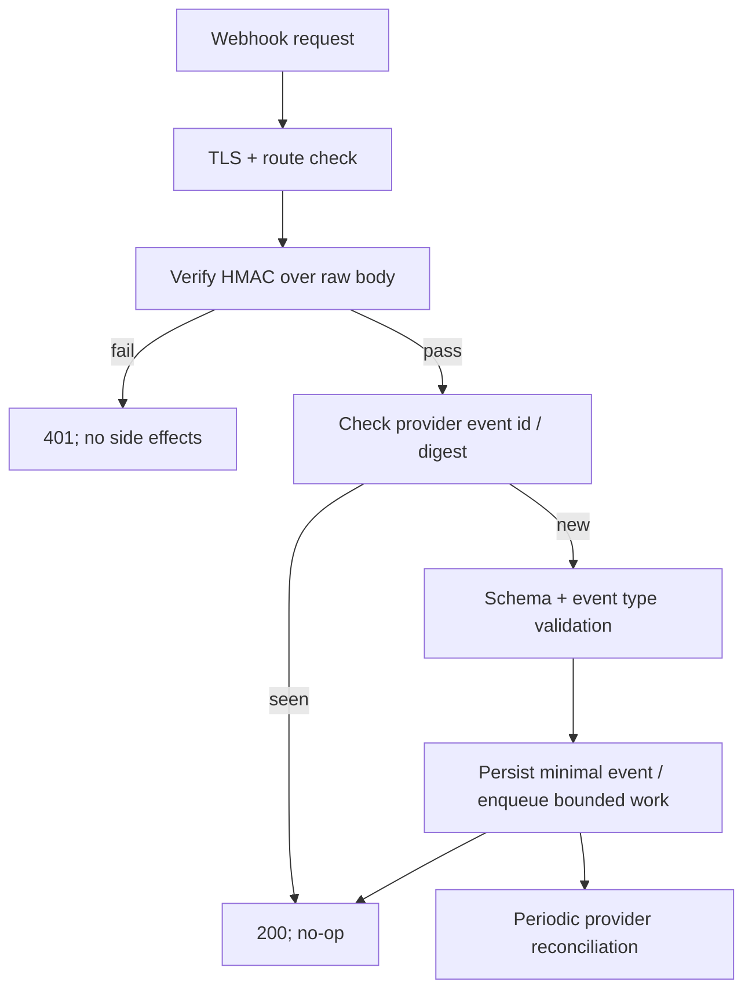
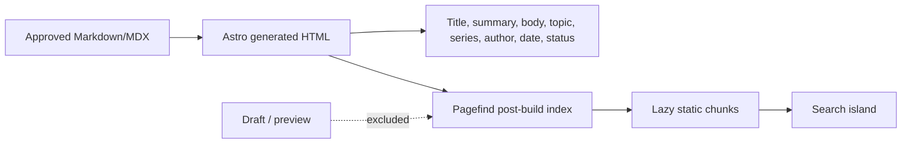
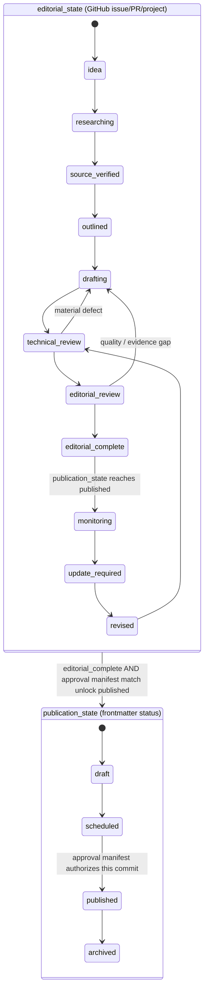
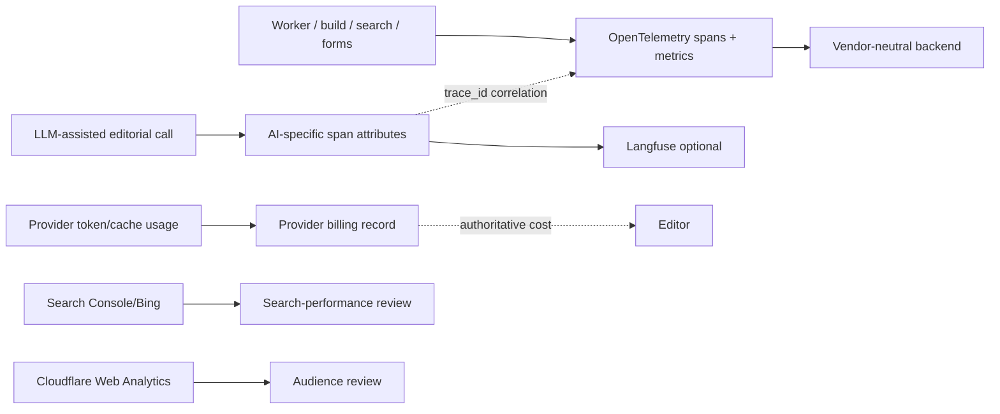
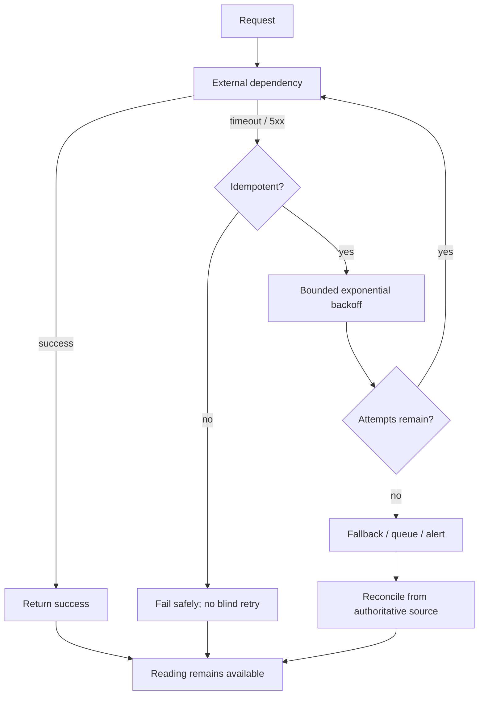

# Data flows

Date: 2026-08-28

## Publication build



## Subscription (future)



## Provider webhook handling



At launch, the Worker webhook route is deferred. If implemented, it must acknowledge only after durable deduplication state exists, or deliberately use an at-least-once provider projection with reconciliation.

## Search indexing



## Two state machines: editorial_state and publication_state

`approved` is not a state in either machine — see `docs/architecture/content-model.md` ("Two state machines"). `editorial_state` tracks research/review readiness; `publication_state` tracks what the site serves. The only bridge between them is the approval manifest, which is neither state: it is CI evidence (protected-branch review, required checks, CODEOWNERS, deployment-environment authorization) for one exact commit.



## Scheduled publication

```mermaid
sequenceDiagram
  participant G as GitHub cron (UTC)
  participant C as Checkout main
  participant V as Publication gate
  participant B as Astro build
  participant D as Cloudflare
  G->>C: 04:05 UTC daily (07:05 EAT target)
  C->>V: evaluate status + published_at <= now
  V-->>G: fail and alert if invalid
  C->>B: build visible snapshot
  B->>D: deploy if artifact changed
  D-->>G: deployment result
  G->>G: retry safely; artifact snapshot is idempotent
```

## Telemetry separation



## Failure and retry paths


