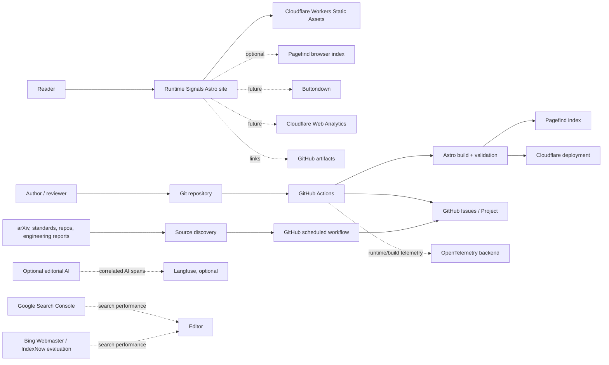

# System context

Date: 2026-08-28  
Status: proposed

## Trust zones

1. **Public zone**: generated HTML, images, feeds, sitemap, and static search assets.
2. **Repository zone**: source Markdown/MDX, citations, private issue discussions, review history.
3. **Automation zone**: GitHub Actions tokens, deployment credentials, scheduled jobs, provider secrets.
4. **Provider zone**: Buttondown subscriber and delivery data; Cloudflare analytics; search-engine consoles.
5. **Operator zone**: reviewer accounts, environment approvals, exports, incident response.

The public zone must never trust content just because it arrived from the repository. CI validates it, and untrusted fetched content remains data rather than executable markup.
