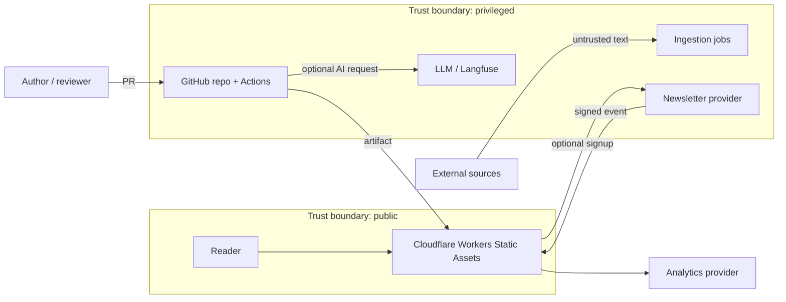

# Threat model

Date: 2026-08-28

| Threat | Impact | Primary mitigation | Detection/recovery |
| --- | --- | --- | --- |
| GitHub account compromise | Malicious publication or secret theft | MFA, protected branch, CODEOWNERS, environment reviewers | Audit logs, revoke tokens, redeploy last known-good SHA |
| Malicious PR/dependency | Build compromise | Pinned actions, lockfile review, no secrets on PRs, dependency audit | CI alerts, compare artifact, rollback |
| Executable MDX | Build-time code execution or XSS | Trusted-author boundary; Markdown default; allow-list components | CI policy scan; remove/quarantine content |
| Stolen deploy credential | Unauthorized public artifact | Short scopes, protected environment, rotation | Cloudflare/GitHub audit; redeploy known-good artifact |
| Forged webhook | Subscriber-state corruption | HMAC raw-body validation, event ID dedupe | Reject/audit; provider reconciliation |
| Subscription bombing | Provider reputation or resource abuse | Double opt-in, generic response, rate limit, Turnstile if needed | Provider abuse reports and rate dashboards |
| Search XSS/DoS | Reader harm or browser exhaustion | Safe text rendering, result/page caps, static index limits | Browser tests, error telemetry |
| Preview leakage | Unpublished research exposure | noindex, access controls, no production links/index | Search audit and revoke preview |
| Analytics leakage | Privacy harm | No PII/raw queries, minimal provider, short retention | Payload tests, periodic access review |
| Prompt injection in source | Wrong or malicious editorial output | Treat fetched text as data; human review; no tool authority | AI audit record and source diff |
| External embed tracking | Reader privacy/performance harm | Prefer local diagrams; review every embed; CSP | Dependency/content review |
| Accidental scheduled publish | Reputation harm | Future-date gate, required approval check, deployment audit | Unpublish by commit and redeploy |

## Phase 5 review

Reviewed 2026-09-01 against the current `main` workflows and live public
deployment. No new application threat was identified. The preview workflow is
read-only and secret-free by construction; the production workflow is the only
path that reads the Cloudflare credential and is protected by the `production`
environment approval. Dependency advisories returned zero high-severity
findings for the pinned lockfile. Remaining risk is operational: backup,
rollback, external alert routing, and assignment of an independent second
incident contact still require an operator rehearsal (see
`docs/operations/phase-5-readiness.md`).

See `docs/security/incident-response.md` for the response procedure, severity tiers, and escalation path once any row above is triggered.
